.. _day1:
.. title:: Introduction to Docker

Day 1 - General Docker
================================================

Now that John roughly know what containers are he sets out to his quest to get to understand containers based on Docker. To get his knowledge updated he wants to end this day by being able to have a container running.
His overall plan for this day looks like:

#. Get the requirements sorted
#. Install Docker
#. Running a container
#. Some simple management

.. note::
	All shown screenshots are examples. Your IP addresses will be different as shown in the screenshots throughout the workshop!
   Estimated amount of time: **45 minutes** for the lab, plus **30 minutes** max. for preparing the laptop.

Step 1 - requirements to get Docker running
+++++++++++++++++++++++++++++++++++++++++++
John will be using his laptop for everything in his quest, he installs everything local. He has created and/or downloaded the following:

#. Download and Install Virtual Box and expansion pack (https://www.virtualbox.org/wiki/Downloads)
#. Get the Ubuntu 18.04 ISO for creating the Test VM (http://releases.ubuntu.com/18.04.4/ubuntu-18.04.4-live-server-amd64.iso)
#. Created a Github account (http://github.com) so he can store his progress in a repository. As this is a start for now he’s using the online version of a repository. There are repos that can live in the network of an organization, but that is for a later time.
#. Created a Dockerhub account (http://hub.docker.com) so he can store images, as recommended by Docker.
#. Downloaded and installed GitHub desktop (http://desktop.github.com) for pushing, fetching and pulling code and files so he doesn’t have to use the git command line interface as he is used to working with a GUI application.
#. Downloaded and installed a tool so he can syntax highlighting for the file he needs to create. Examples: Sublime Text 3, Atom, Visual Code from Microsoft. In John’s case he downloaded and installed Microsoft Visual Code (https://code.visualstudio.com/)
#. Added plugins into visual code so he has syntax highlighting for:

   #. Container (https://code.visualstudio.com/docs/containers/overview)
   #. Bash (https://marketplace.visualstudio.com/items?itemName=mads-hartmann.bash-ide-vscode)
   #. Python (https://marketplace.visualstudio.com/items?itemName=ms-python.python)
   #. Git integration in Visual Code (https://marketplace.visualstudio.com/items?itemName=eamodio.gitlens)

After having the Virtual Box installed and created a Ubuntu 18.04 server as a VM in Virtual Box. The installation of Ubuntu18.04 has been a default one where he only selected the OpenSSH server installation so he can use a ssh session to run his tests. The network of the VM is set as a **bridged network** so the VM can talk to the outside world and John can connect to the VM, without having NAT settings in Virtual Box. John has his testing environment for his quest in the world of Docker ready. He writes down the IP Address of his VM, by using the console and running the **ifconfig** command.

Step 2 - Installing Docker
++++++++++++++++++++++++++

Now that the requirements, from an applications perspective, is ready. John needs to get the most important part installed on his testing machine; Docker itself. He followed the below steps to get Docker installed on his test Ubuntu VM

#. John starts the Ubuntu server and makes a connection of SSH to the Ubuntu server using the command **ssh <USERNAME DURING SETUP>@192.168.1.157** (For Windows use putty and the username you set in the VM) and the set password during installation.
#. He then follows the instructions as mentioned on https://www.digitalocean.com/community/tutorials/how-to-install-and-use-docker-on-ubuntu-18-04 to get Docker installed. They boil down to:

.. code-block::bash
   sudo apt update
   sudo apt install apt-transport-https ca-certificates curl software-properties-common
   curl -fsSL https://download.docker.com/linux/ubuntu/gpg | sudo apt-key add -
   sudo add-apt-repository "deb [arch=amd64] https://download.docker.com/linux/ubuntu bionic stable"
   sudo apt update
   apt-cache policy docker-ce
   sudo apt install docker-ce
   sudo systemctl status docker
   sudo usermod -aG docker ${USER}
   su - ${USER}

#. After everything has been done according to the webpage he types **docker version** to see if all worked as expected.

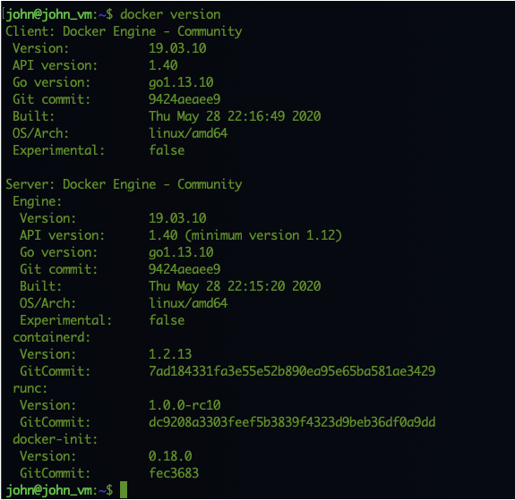

Ok, Docker is installed and running in the background. Time for the next step.

Step 3 - Running the first container
++++++++++++++++++++++++++++++++++++

Docker has the possibility to “pull” images from an images repository and run the image as a container. To test this all works, he types **docker pull hello-world** to see if his docker installation is capable of pulling images from a repository. 

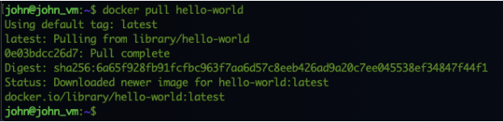

As John sees in his terminal, the command was able to pull the latest version of the Hello-World image. Now let’s run the container to get some output. He types **docker run hello-world** to get the container running.

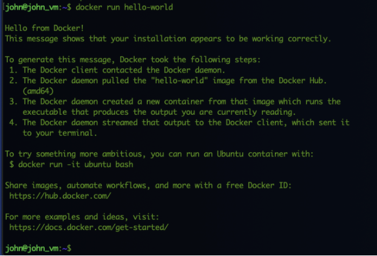

This simple container shows some information and then ends.

Step 4 - simple container management
++++++++++++++++++++++++++++++++++++

Next step John is interested in how can he manage containers? He is looking to get the following answers:

#. Which container do I have on my system?
#. How can I stop and start containers?
#. Which container is running, if any?
#. What are the ports running containers have exposed, if any?

Which containers are there on the system
.......................................

To see what containers are on John’s machine he found, using Google, a command that shows exactly what he needed docker container ls. After running the command in the terminal session the list was empty... “Hmm what have I done wrong? There should be at least the hello-world container as I ran that....”. A more narrow search revealed that the docker container command only show **RUNNING** containers. Adding the option *--all* (dashdashall)shows ALL containers running or not (https://docs.docker.com/engine/reference/commandline/container_ls/). So he used the command **docker container list --all** and sees the hello-world container with the status Exited (0) and when the Exit status happened.

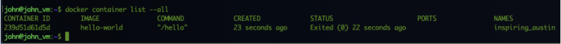

As the hello-world container is just an output of text it will automatically stop and exit back to the command prompt.

Which images do I have on my system?
....................................

As containers are based on images, there must be images on John’s machine. To see the images that are available on his machine, he types **docker image ls** to see them.

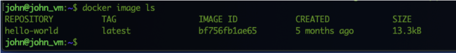

The hello-world image is available and shows a few parameters of the image including age, IMAGE ID and size.

Starting containers from an image
.................................

To start containers John ran a simple command that included the Image ID of the hello-world image. He types docker run hello-world. As the image has already been downloaded (pulled), Docker will not redownload the image (unless there is a newer version) and run the container.

Start a container when it has already run
.........................................

John now wants to run the container that he already had started earlier. To do that, he types **docker container ls --all** to see all containers. He sees two containers with both the Exit(0) status and the time frame when the exit happened.

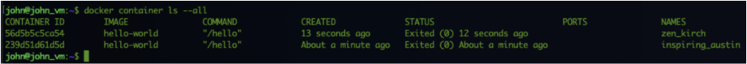

To run the first, youngest container, he types **docker start {CONTAINER ID}** and sees now output... Just the same CONTAINER ID he used to start the container. “Wait a minute... I must have done something wrong, maybe a typo..”, so John retypes the same command with the same result. Just the container id is shown by Docker, not the amount of text he had in his earlier attempts.... Then it hit him. One of the Cons of container is that it doesn’t have a UI! So something like a headless server. “Now how do I get the output of the container?”. Searching the internet gave him two possibilities. One add some extra parameters to the **docker start** command or two run **docker logs** command to get the console output of the container.

Docker start with extra parameters
..................................

John types the **docker start -a {CONTAINER ID}** command in the terminal session and voila! Here is the output he’s seen before...

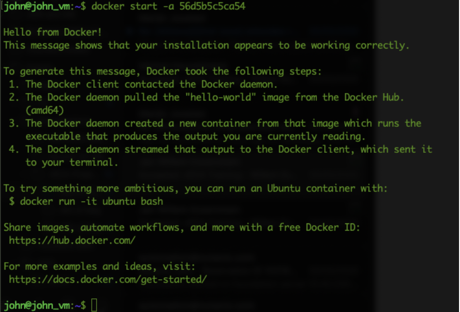

(https://docs.docker.com/engine/reference/commandline/start/).  All good now. Let’s try the other command.

Docker console information
..........................

Using the command **docker logs {CONTAINER ID}** John was also able to see the console output without restarting the container. As he has restarted the container a few times, the console is showing all console outputs the container ran.

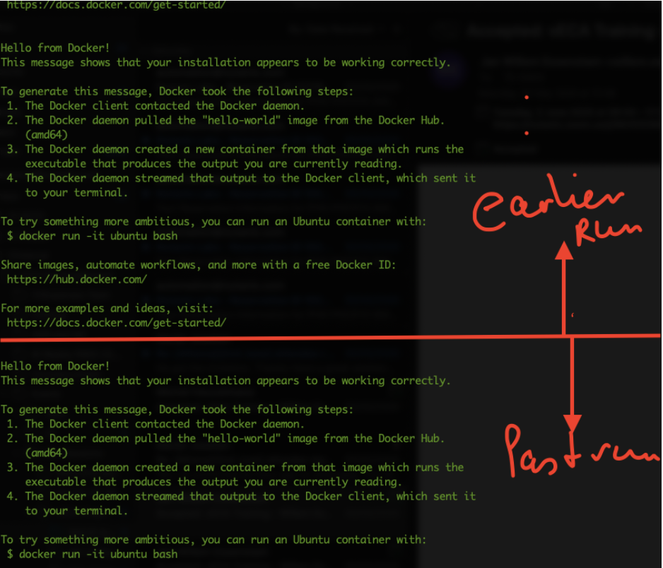

See which container is running
..............................

Now that John knows how to see images, containers and starting containers, how can I see which containers are running and extra information in the containers?
As the hello-world container is exiting after it has shown output, John is searching for a container that will stay active for a longer time. As the organisation is running NGINX web servers and load balancer, John is trying the following command; **docker pull nginx** as he has read that NGINX can be run as a container. He sees that the command is indeed pulling a NGINX image from the internet.

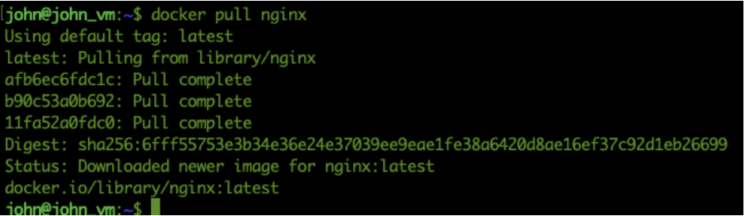

To start the nginx image he types **docker run nginx** and hits the enter key... Nothing... Cursor is blinking, but nothing, no output, nothing... Ok after CTRL+C he got his prompt back... John used the commands **docker container ls --all** and **docker logs {CONTAINER ID}** command to see if anything happened in the console. Nothing. Empty... John rereads some of the docker pages at https://docs.docker.com/engine/reference/run/ and sees that he needs to use the -d command to run the image as a container in the background. So he types **docker run -d nginx** and ok, he has his prompt back and it seems that something has started as the command returned a long UUID.

.. figure:: images/10.png

Now John has some experience with Linux and know that the command **ps** show the process list. Maybe Docker supports the same, so he types **docker ps** in the terminal session and sees information on *running* containers like the name of the container, image that was used for the container and ports that are exposed, if any.

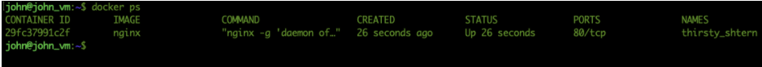

Now that there is a container running, we should be able to stop the container by using **docker stop {CONTAINER ID/NAME}**. John runs the command to stop the container using the information from the shown screenshot. After a while the prompt returns and provides the used CONTAINER ID/NAME from the **docker stop {CONTAINER ID/NAME}** command. A quick check using **docker ps** shows that there are no containers running anymore.

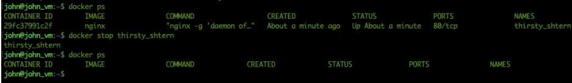

Adding **--all** *(dash dash all)* to the **docker ps** command (**docker ps --all**), John found that that command shows ALL containers that have run on the system. 

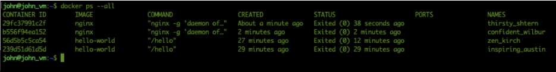

Which ports expose the containers?
..................................

As John saw in the started NGINX image, via **docker ps**, he saw that the container has a port 80/TCP exposed. John started the container again using **docker start {CONTAINER ID/NAME}** and used docker ps to see that the container is in a running state.

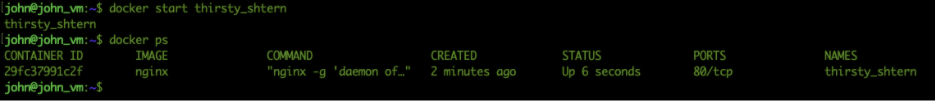

The last command shows that the container has port 80 open. John tries to connect to the localhost on port 80 using a web browser, but no such luck. The page shows nothing. Then he remembered that containers are isolated from the rest of the processes. “Maybe that is the reason for me not being able to connect?.. Are there any other parameters I need to provide so I also “open” the ports into the container?”. Again Googling, everybody's friend, he found that if the container has ports that need to be exposed to outside the container he could define the ports and it’s mapping, or just use a parameter to allow all defined ports in the image to be exposed (https://docs.docker.com/engine/reference/run/). 
Only stopping and starting the container is not enough. It’s the same as starting and stopping an engine where you made no changes but you want to give the engine more power. As we need to make a change to configuration of the container we need to create a new container. Containers John remembered as immutable (Read Only) as soon as they’ve been created. John follows these steps to get the running container stopped and to create a new container which will expose its defined ports to the outside world.

#. In the terminal session; **docker stop {CONTAINER ID/NAME}**
#. **docker run -d -P nginx**
#. **docker ps** to see if there are any changes for the earlier container he ran

   .. figure:: images/15.png

#. He starts a web browser and opens URL \http://**<IP_ADDRESS_VM>**:32768 (the port that is shown in the 0.0.0.0:32768->80/TCP result of the **docker ps** command)

Eureka!!! The page is loading as John is used to in a clean nginx installation

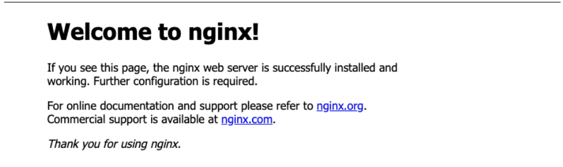

Now John is not entirely happy as the port he got from the run command is not exactly what he had hoped. It should have been something like port 80, or maybe 8080, but certainly not a random number. He wants to have more control over it. So he stops the container (**docker stop CONTAINER NAME/ID**) and recreates a new container where he decides that the port for the external world must be 8080. So he followed the same steps as before, but now changed step two with **docker run -d -p 8080:80 nginx** and **docker ps** to see the results of that command.

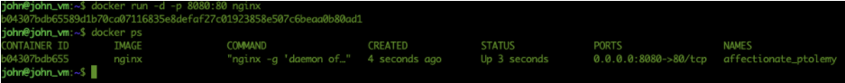

The **docker ps** command suggests that the container is now listening in port 8080 on the outside world. Let’s try and see...

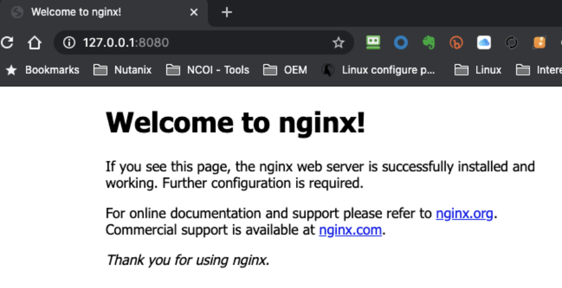

Yes it works!!! Hahahaha oh I love my job.... Let’s call it a day and tomorrow we start to see how we can manipulate the images, containers from a content’s and config’s perspective...
