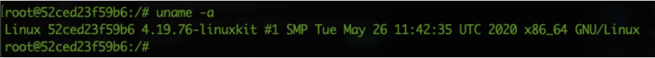
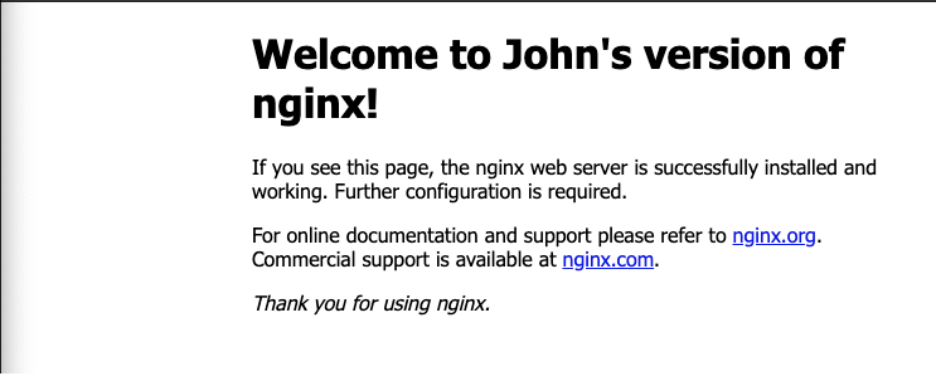
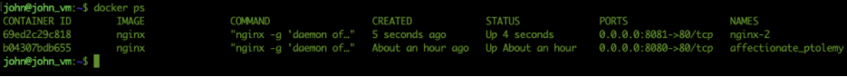
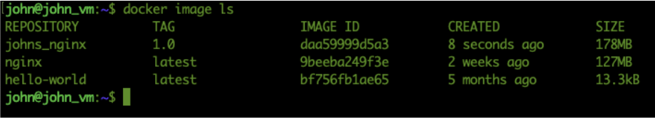
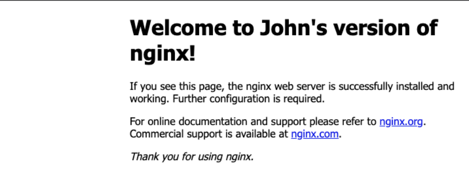
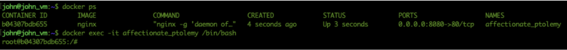

.. _day2:
.. title:: Introduction to Docker

.. note::
   Estimated amount of time: **30 minutes**

Day 2 - More advanced Docker
============================

Now that Docker and the test environment, based on VMs, is running, John sets the following for his quest:

#. Create his own containers
#. Create a container based load balancer for the webserver from yesterday

.. note::
	All shown screenshots are examples. Your IP addresses will be different as shown in the screenshots throughout the workshop!
   
Step 1 - Change the images/containers
+++++++++++++++++++++++++++++++++++++

John knows by now that the containers are immutable as soon as they have been created. Meaning that any change to the container will be lost as soon as the container dies and a new one is created from the image. So instead of changing the container, John is going to make a change in the image. To make this happen, John needs to follow a few steps:
#. Have the container that is using the image in a running state.
#. Able to connect/attach to the container
#. Make the changes
#. Test the changes
#. Commit the changes to the image as a new image

Run a container based on the images that needs to be changed
.............................................................

John wants to change the nginx image he used in earlier. So he runs **docker ps** to see if the container is running. As he didn’t shut down his laptop yesterday, he sees that the nginx container is still running and still listening on port 8080. He tries the URL http://127.0.0.1:8080 and still gets the same page as yesterday. Now to make the change easy he is going to just change some text in the default page of NGINX. 

If the container would have been stopped, John would just have run the command **docker container ls --all** to get the CONTAINER ID/NAME that must be used in the **docker start {CONTAINER ID/NAME}** command to start the container that is using the image John wants to manipulate.
Now that the container is running John needs to attach a command line to the container. As he remembered from yesterday a container is not a VM, so SSH will not work. Reading some articles on the internet and on docker.com he finds a command that allows him to attach to the container **docker run exec -it {CONTAINER NAME} command-to-run** command. As he needs the command line he tries **docker run exec -it {CONTAINER NAME} /bin/bash**. This command opens a prompt that he doesn’t recognize as his machine. He must be in the container now!?

To make sure he is not he runs the command **uname -a** to get some system information

Yep not my machine. 

Make changes to files in the container
......................................

Now that he is in the container, he wants to change the text that the NGINX default page is showing. After reading the **cat /etc/nginx/conf.d/default.conf** file in the container to know where the html files are for NGINX, **/usr/share/nginx/html**, he opens that location in the container. There he sees the index.html file that is shown as the default page. Using **vi** John wants to change the file. After he types in vi he gets a command not found error. Heee, that is normal on all Linux distributions he worked with. Then he remembered again what containers are, a construct that only has the minimum Operating System binaries and supporting binaries to run one application. 

After John ran the command **apt update** (to get the container to know where the get installation and update files) he runs **apt install vim -y** and hits the Enter key. This process will install vi in the container. Now he can manipulate the index.html file.
In the vi interface John changes the text of the HTML file in **two places**:

#. <title>Welcome to John’s version of nginx!</title>
#. <h1>Welcome to John’s version of nginx!</h1>

He saves the file and exit vi by pressing **<ESC> :wq!** He then returns to the browser and refreshes the page... Yes it worked.

The title and the page itself have changed... John exits the container via **CTRL+D** and comes back in the prompt of his machine. Refresh of the page still shows the correct information. Great! Now let’s see what happens when we stop the container. Is the changed data still there?
**docker stop {CONTAINER ID/NAME}** stops the container and the browser is showing as expected no page, but an error message. **docker start {CONTAINER ID/NAME}** as expected starts the container and shows the same page *WITH* the changes! Now let’s create a new container from the image nginx and see what happens and give it a name that I like, not like docker is doing now. Some random names by using the *--name* (dashdashname) parameter...

John runs the command **docker run --name nginx-2 -d -p 8081:80 nginx**. As there is already a nginx server running on port 8080, John needs to use a different free port. Running the **docker ps** command John sees two containers running with each a port exposed to the outside world as defined with the *-p* parameter.

“Hmm now the container on port 8081 is showing wrong information when I open the URL \http://**<IP-ADDR-VM>**:8081 in a browser. Not what I wanted, but I should have known! Containers are isolated from each other and are by default immutable. Containers are created from images, so I should have done something to make the change stick in the image....”. Next try...

Change the images
.................

John wants to start with a clean slate and removes the second nginx container by following the next steps:

#. **docker stop nginx-2**; to stop the container
#. **docker container rm nginx-2**; to remove the container (https://docs.docker.com/engine/reference/commandline/container/)

Now that the latest container is gone, John checks that the first container on port 8080 is still ok. That is the case. Using **docker ps** John gets the ID of the container. Then he runs the command **docker commit {CONTAINER ID/NAME} johns_nginx:1.0** (https://docs.docker.com/engine/reference/commandline/commit/). The command **docker image ls** shows that docker has created an image with the change and that the image is larger than the original nginx image.

Use the new image
.................

Now John creates a new container using the just created image and use port 8081 for the outside world. John runs **docker run -d -p 8081:80 IMAGE_ID** (of johns_nginx image) and opens the web browser to see the result.

“Ha the same as the one running on port 8080! Great! So that worked....!”
Well progressing greatly, but I’m done for today. Need to get some other stuff to do. Will pick this up tomorrow.

