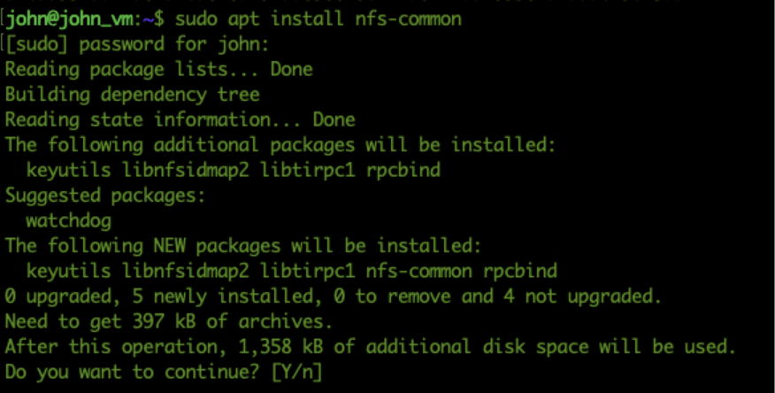
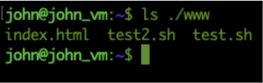
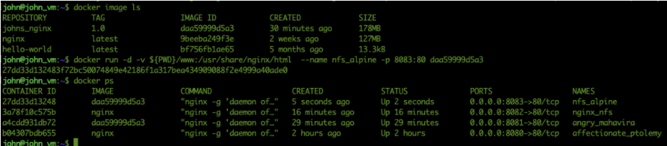
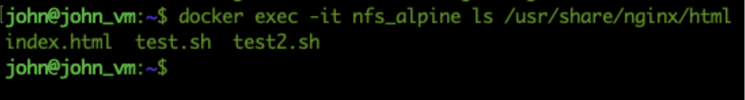
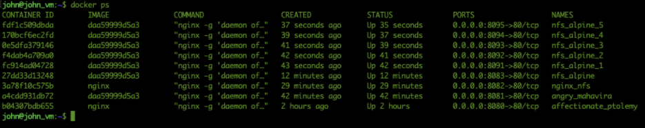
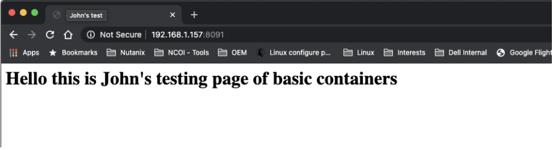

.. _day3:
.. title:: Introduction to Docker

.. note::
   Estimated amount of time: ``45 minutes``

Day 3 - More advanced Docker
============================

John is now three days into his project and already capable of pulling, starting, stopping, attaching to containers, make changes in the container and save the changes into a new image. The last step using the new image for a new container made John think last night while being in bed and trying to fall asleep. "Hmm nice that I can make changes in an image and then use that new image for a new container with the same configuration and files. But what when I have a lot of changes and need to be more flexible in where I put the files that are being used by the nginx binaries for instance? For instance the configuration files for load balancing. We change the amount of servers quite often per month due to reporting etc. There has to be a solution. That solution must also be available to share the files across multiple containers so all have the same data."

Another question kept John haunting through the night:"I built the images on my local machine, how do I get them into the remote systems? How can I make it portable as that is what’s being asked for by my organization? It is even the main requirement."

So John created his new small quest for the next phase of his project. The quest he embarked on is to get answers to the following two questions:

#. How to detach files from the container so we can manipulate files without changing the image often for a minor change in a HTML file for example, and share the data between containers?
#. How do I make the images/containers portable so I can use my wherever I have Docker running?

Detaching files from the container
..................................

John read a lot of articles and stumbled in the Docker.com page over Volumes and their use cases. The use cases of Volumes are that you want to have mounts, or files that reside outside of the container accessible by the container (https://docs.docker.com/storage/volumes/). That way data is persistent and containers can be recreated using a new image but still have the accessibility to the data.

Another idea that came up while reading the ``docker volumes`` command and the parameters was that other containers also need to be able to read and write the data so there is only one set of data that is being used, independently of the images and the containers running. To solve this issue, John installed a small Linux distribution called Alpine. He read in a lot of articles that this distro is very known in the docker world as it is small. He used the article from https://wiki.alpinelinux.org/wiki/Installation to install his version as a VM. He wants to use this as a NFS server to serve as the datastore for his containers. He ran the following steps:

#. Download the Standard version iso image from http://dl-cdn.alpinelinux.org/alpine/v3.12/releases/x86_64/alpine-standard-3.12.0-x86_64.iso
#. Created a VM in VirtualBox with a drive of 8 GB and the downloaded ISO image as Virtual Media
#. Booted the Alpine VM in VirtualBox using the downloaded ISO image
#. Ran ``setup-alpine`` to install Alpine to the drive
#. Rebooted according to the installation "wizard"
#. logged in as root and the set password
#. Ran ``apk update`` and ``apk upgrade`` commands to have the latest version of the packages.

Now comes the hard part, installing and configuring a NFS server. But that was easier than he expected. He found an article that describes what the steps are to install the needed software and what to configure so he would have a NFS export that he intends to use for his containers (https://wiki.alpinelinux.org/wiki/Setting_up_a_nfs-server ).

The export he defined in ``/etc/exports`` is  ``/www 192.168.1.0/24(rw,no_root_squash)`` (based on the fact that the network the VMs are running in are 192.168.1.0/24!). The export /www lives in the root of the Alpine VM. "Not the best location from security’s point of view, but we’ll fix that later." he thought. He restarted the NFS server using the same command that was described in the used article: ``rc-service nfs restart`` so that he was 100% sure the configuration would be read. The IP address of the VM (``ifconfig``), he noted on a piece of paper so he could use that if needed; 192.168.1.220. To test the NFS in a later stage of his quest he put some files in the just created /www folder on the Alpine VM by using the ``touch`` command. He typed in the console of the VM ``touch /www/test.sh`` and ``touch /www/test2.sh``. "Now I have at least some files in there that I should see in the container if I use the volume". 

He Googles the internet and found a good article that describes that; https://www.tecmint.com/install-nfs-server-on-ubuntu/. He followed the article to get the NFS client installed on his Docker test VM.

After he mounted a newly created folder (WWW) to the export of the NFS server using ``sudo mount -t nfs 192.168.1.220:/www ${PWD}/www``. After this command he types ``ls ./www`` to see if there are at least the two files he created earlier in the Alpine server.

Yes, that worked! Ok next step. How can I use that nfs/folder with my nginx container?

He then reread the article on docker volume and found what he was looking for. The command to connect a folder to a target in a docker container and added his parameters to the command and also using his latest image he build. He types ``docker run -d -v ${PWD}/www:/usr/share/nginx/html  --name nfs_alpine -p 8083:80 daa59999d5a3`` (*dashdashname*). Image ID from ``docker image ls`` command) and hits the Enter key to have the container created. 
Is it running? John runs ``docker ps --all`` to see which containers are running/have ran..

He sees his just created container nginx_nfs and it is still running... Great news. Now let’s see if the attached Volume is in the container at the location he provided /usr/share/nginx/html/ and the content of that folder... He rushing in to run a command against the container ``docker exec -it nfs_alpine ls /usr/share/nginx/html``.

He sees the NFS content! “Yihaa! This container is now using remote data... That is much easier if I need to have multiple containers using the same data! No more images to be updating if they need a small change in the HTML related space.” he thinks....

He opens on his own machine http://www.nutanix.com and goes to see the source of the page. He copies the source into a new file called index.html in the NFS share and saves the file in the NFS share. He then changes to the IP address of his machine on port 8083 to see if the nginx container shows the page. Maybe not 100%, but at least the basics... Well that work. Not the best experience, but at least I have something to test with... So he creates a simple script that will start 5 containers using port 8091 till 8095 and using the same file location as this container he is running. The script looks like this:

.. code-block:: bash

	for i in 1 2 3 4 5; do docker run -d -v ${PWD}/www:/usr/share/nginx/html  --name nfs_alpine_$i -p 809$i:80 daa59999d5a3; done

He sees five containers being created as a result of the command. Also ``docker ps`` show the new containers running.

He tries the five pages and sees the expected pages...

Great that is working! Now I have 6 containers running and using the same data files. Let’s make a small change. John removes the index.html file in the NFS location creates a simple index.html file to see if the new containers will grab this data:

.. code-block:: html

	<html>
		<head>
			<title>John's test</title>
		</head>
		<body><H1>Hello this is John's testing page of basic containers</h1></body>
	</html>

He saves the file and retries the 5 urls.
All are showing the page as he expected them to be...

YES!!! That is enough for this day... Calling it a night and we’ll move on to the next task tomorrow... How to get a load balancer in front of the web servers using a container...
