.. _day4:
.. title:: Introduction to Docker

.. note::
   Estimated amount of time: ``90 minutes``

Day 4 - Connect containers together
===================================

John has found out yesterday that he could use a NFS server as a shared location for files so these files are outside of the container. That way he was able to create 6 webservers that where using the files. For today he has set the following goals for his quest:

#. Create a container based load balancer
#. Create a Dockerfile for his personal image

.. note::
	All shown screenshots are examples. Your IP addresses will be different as shown in the screenshots throughout the workshop!

``SKIP THIS STEP IF CONTAINERS ARE STILL RUNNING OR FACE ERRORS``
As John has now got 5 Webservers configured he now starts to investigate which Load Balancer he wants to use. He starts the stopped containers (he shutdown his Laptop the night before) by using a simple bash script: 

.. code-block:: bash

	for i in 1 2 3 4 5; do docker start nfs_alpine_$i; done. 

This starts the webservers and have them listen on the port he tested yesterday. To be 100% sure he tests the 5 servers to see the same reply as yesterday. The script he uses is (https://superuser.com/questions/272265/getting-curl-to-output-http-status-code). 

.. code-block:: bash
	
	for i in 1 2 3 4 5; do curl -I -s -o /dev/null -w "%{http_code}" http://192.168.1.157:809$i;echo ; done 

.. note::
	The IP Address is the IP address from the ifconfig command of the VM

This will return just a status code. 200 means the website is active and listening.

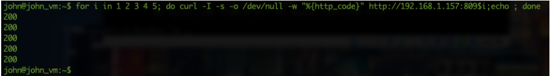

So all good. They are responding to those port...

Ok now the load balancer. Let’s investigate using Google if there is a container based version of NGINX that I can use for that. I know the not containerized version can do that, so I suspect there will also be a container version.

The article he found, https://levelup.gitconnected.com/set-up-a-nginx-load-balancer-for-a-dockerized-node-js-application-6bff1a54655a, was not exactly what he searched for, but it still had a good clue. Also he saw for the first time that he can create a container using a file called *Dockerfile*. "Hmmm... maybe I want to use that from now on and build my own images/containers and constantly being dependent on already built containers... Let’s give it a try."

He started to create a directory on the Ubuntu server called nginx_lb using ``mkdir -p nginx_lb``. Then he “cd-ed” in the directory and started the vi editor to create a Dockerfile file in this directory.

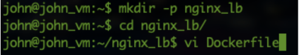

In this file he copied the information he found in the article.

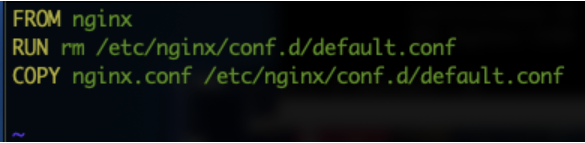

He closed and saved the file by using the key combination ``<ESC>:wq!``
John created the nginx.conf, as mentioned in the article, but made changes to the servers that were mentioned to his test environment.

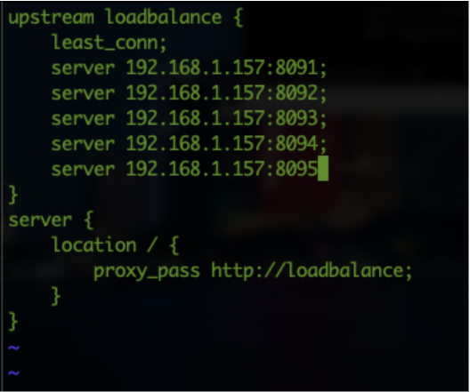

Still in the nginx_lb directory he runs the command ``docker build -t nginx_lb:1.0 .`` to have the image build. This would be tagged (*-t*) as nginx_lb with version 1.0 of the image...

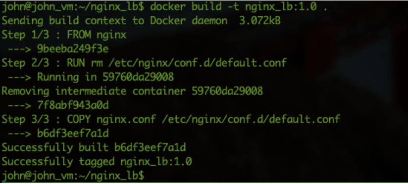

"Ok that went easy and well... Let’s see if the image is to be found using ``docker image ls``."

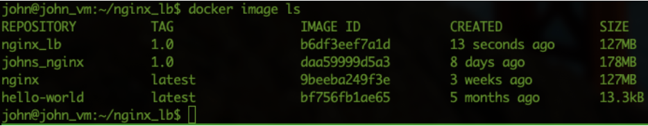

"Yes it is!!! Ok now let’s create a container with this image...". John runs the command ``docker container run -p 80:80 -d nginx_lb:1.0`` to start the NGINX load balancer and it should listen to port 80 on the local machine. After the command returned a long UUID John runs the ``docker ps`` command to see if the container is running and listening on port 80.

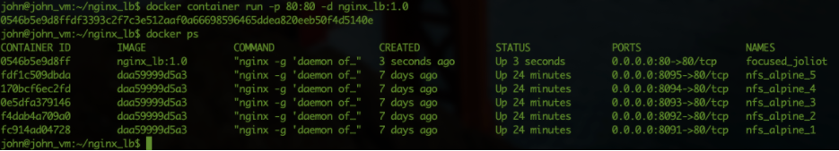

He sees the process running and tries the browser to see if the webservers are responding. "Hmm how can I see which server is being used for the reply?? Let’s see what I can do for that..." John searches the internet and finds an article in the official site of NGINX https://docs.nginx.com/nginx/admin-guide/monitoring/logging/. He logs into the container using ``docker exec -it focused_joliot /bin/bash`` (focused_joliot is the name of the container as seen in ``docker ps``!) and wants to change the following two files: ``nginx.conf`` and ``default.conf``. He quickly finds that the ``vi`` command is not working. So he uses the normal package installer of Ubuntu ``apt`` to install ``vi``. He understands that is not the correct way, but he just wants to test the changes.

Change the nginx.conf file
..........................

After he got the vi installed he uses ``vi /etc/nginx/nginx.conf`` to add a parameter to the line log_format. He adds ``$upstream_addr`` to the end of the line.

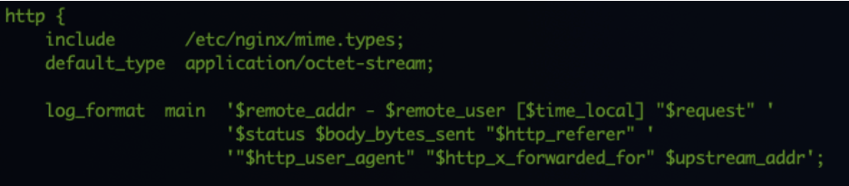

Using the ``<ESC>:wq!`` Combination he closes vi and saves the file.

Change the default.conf file
............................

He uses the command ``vi /etc/nginx/conf.d/default.conf`` to change the file. He adds in the ``server {`` part ``access_log /var/log/nginx/access_lb.log`` main; This way he gets a separate log file for all forwarded HTTP requests. The log should look like the line where it says log_format main and all the parameters that have been defined there.

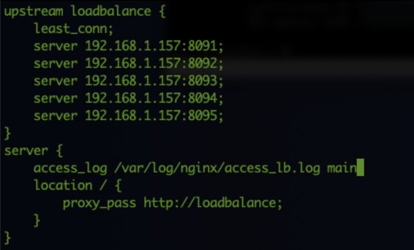

Reload the NGINX configuration files
....................................

As John has made a change to the configuration of NGINX, the process needs to know about the change. John runs in the NGINX Load Balancer container the command ``nginx -s reload`` to have the NGINX server reload the configuration files without going down! Now let’s test this... John exits the container by using ``CTRL+D``.

John opens the browsers again and hits the refresh/reload button a few times. He then runs the command ``docker exec focused_joliot tail -f /var/log/nginx/access_lb.log``. To his excitement he sees that the nginx load balancer is forwarding to all the other containers...

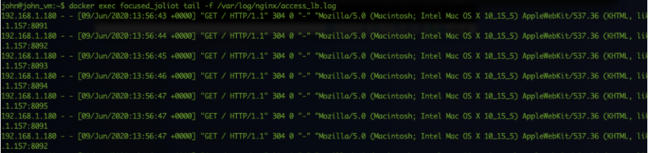

Hitting the browser refresh a few times extra is showing new lines in the CLI and the load balancer is using ALL the web servers that have been assigned... He cancels the ``tail -f`` via the ``CTRL+C`` method.

John changes the config file he has in his nginx_lb directory and renames it to ``default.conf``.
The default.conf holds the following information:

.. code-block:: bash

	upstream loadbalance {
	    least_conn;
	    server 192.168.1.157:8091;
	    server 192.168.1.157:8092;
	    server 192.168.1.157:8093;
	    server 192.168.1.157:8094;
	    server 192.168.1.157:8095;
	}
	server {
	    access_log /var/log/nginx/access_lb.log main;
	    location / {
	        proxy_pass http://loadbalance;
	    }
	}

He also creates an extra file called ``nginx.conf``. The content from the currently running load balancer. Its content is:

.. code-block:: bash

	user  nginx;
	worker_processes  1;

	error_log  /var/log/nginx/error.log warn;
	pid        /var/run/nginx.pid;

	events {
	    worker_connections  1024;
	}

	http {
	    include       /etc/nginx/mime.types;
	    default_type  application/octet-stream;

	    log_format  main  '$remote_addr - $remote_user [$time_local] "$request" '
	                      '$status $body_bytes_sent "$http_referer" '
	                      '"$http_user_agent" "$http_x_forwarded_for" $upstream_addr';

	    access_log  /var/log/nginx/access.log  main;

	    sendfile        on;
	    #tcp_nopush     on;

	    keepalive_timeout  65;

	    #gzip  on;

	    include /etc/nginx/conf.d/*.conf;
	}

After that he makes changes to the ``Dockerfile`` so they use his files. The ``Dockerfile`` now holds:

.. code-block:: bash

	FROM nginx
	RUN rm /etc/nginx/conf.d/default.conf
	RUN rm /etc/nginx/nginx.conf
	COPY default.conf /etc/nginx/conf.d/default.conf
	COPY nginx.conf /etc/nginx/nginx.conf

He saves the Dockerfile and rebuilds his new image using ``docker build -t nginx_lb:2.0 .``

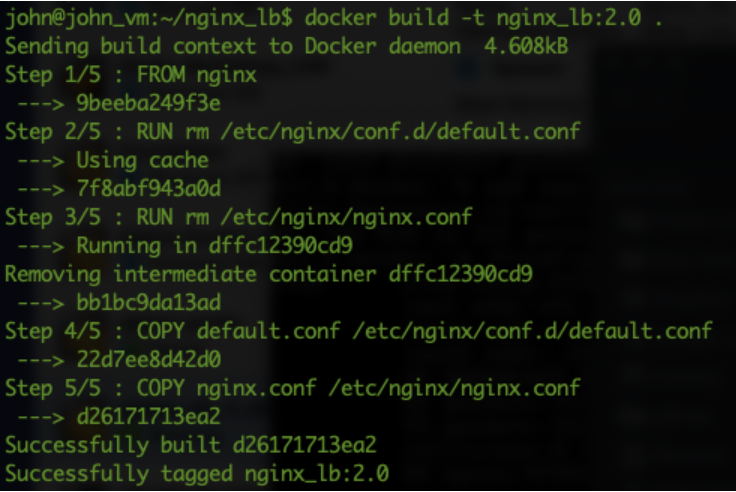

His new version of the image is seen in the docker image ls command. So he stops the current container using ``docker stop focused_joliot`` and starts a new container using the new image. He adds some parameters so he can controls what the name is of the container. He runs ``docker run -d --name nginx_lb -p 80:80 nginx_lb:2.0`` so that he has a container based on the new image 2.0 he just created. Running the command ``docker exec nginx_lb tail -f /var/log/nginx/access_lb.log`` he can see if the load balancer is forwarding all information again like before.

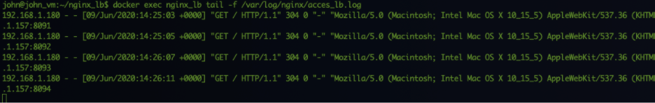

Yes they are providing again access via the load balancer!!!

"Ok next step is that I want to get the configuration files outside of the container. I want to create a container that provides the "application" or "function", but the configuration files, as I may need to change them, need to be outside of the container. And I want to use Dockerfile as well...""

Use of Dockerfile and volumes
.............................

John is starting to see what the Dockerfile can do for him to solve the problem of not changing the image constantly when there is a small config change to be made. He has used volumes before, but he’s not sure if that can be done with just files. John stops the docker container and removes the container using the ``docker stop nginx_lb`` and ``docker container rm nginx_lb`` commands. The container is gone and he has a clean slate to proceed.

He tries the command ``docker run -d --name nginx_lb -v ${PWD}:/etc/nginx/ -v ${PWD}:/etc/nginx/conf.d -p 80:80 nginx_lb:2.0`` to see what would happen if the rest of the needed configuration files are not there... Hmm not working. He sees straight after running the command that the container has crashed (``docker ps --all``)

So he tries again, but runs the command ``docker start -a nginx_lb`` so he can see the console output when the container starts.

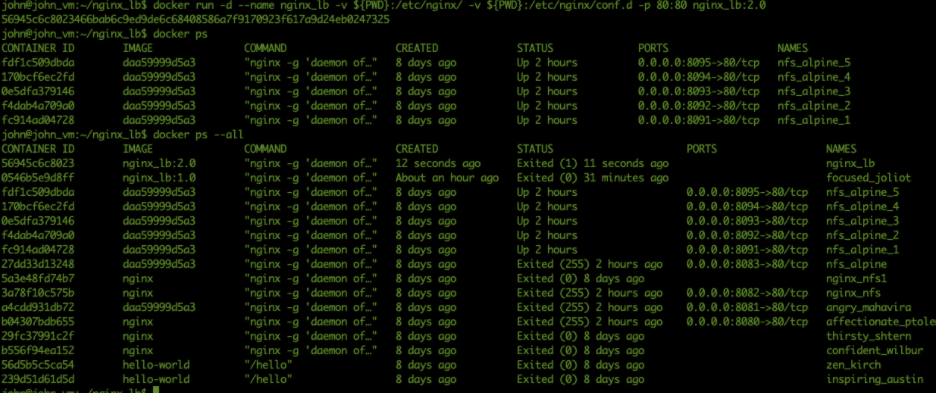

Ok so it searches for other files as well... Ok let’s try to get them copied from another system.
He deletes the container again and starts it without those volume parameters, but with another volumes so he can "copy" the files out of the container.
THe command he runs is ``docker run -d --rm --name nginx_lb  -p 80:80 -v /home/john/www:/www nginx_lb:2.0``. He added the *--rm* parameter to the container so that if the container is stopped it will be removed. After connecting to the container he uses the command ``cp r /etc/nginx/ /www`` to copy the data outside of the container onto the www directory that lives also outside of the container. He exits the container and stop the container. He checks the existence of the container nginx_lb and sees that it is gone.

Using the command ``docker run --rm --name nginx_lb -v /home/john/www/nginx:/etc/nginx/ -p 80:80 nginx_lb:2.0`` he wants to see if the container would start.
"Hmmm. No output... Let’s check via a browser... Hahaha the browser is working again.. Ok now run the container in the background using the *-d* parameter." The command ``docker run -d --rm --name nginx_lb -v /home/john/www/nginx:/etc/nginx/ -p 80:80 nginx_lb:2.0`` returns the UUID and it is running... ``docker exec nginx_lb tail -f /var/log/nginx/access_lb.log`` is showing that the load balancer is using again all the nodes as expected. Now to the test. John creates a blank file using ``sudo touch /home/john/www/testfile``, as this is the location where the nginx load balancer is grabbing it configs from and runs ``docker exec nginx_lb ls /etc/nginx`` to see if the file shows up in the output.

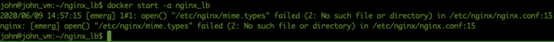

Yes it’s there! So my load balancer uses my configs that are outside of the container. Ok let’s make a small change. John removes three of the web servers in the ``default.conf`` on his test machine in the www/nginx folder (using ``sudo vi``)

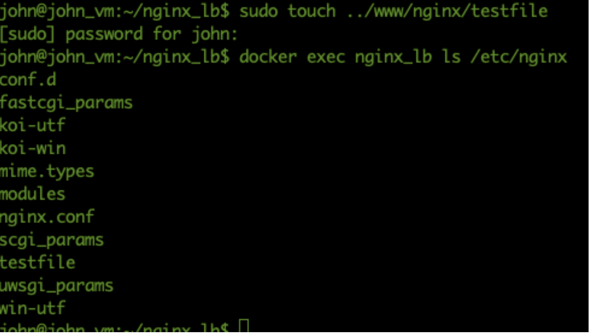

He restarts the nginx load balancer using ``docker exec nginx_lb nginx -s reload`` to see if the new configuration is working. Yes it is. Now only the remaining nodes in the configuration he just changed are servicing the http request. He still sees the old lines, but they are history.

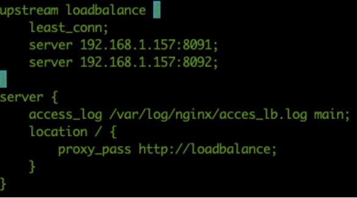

Using this, he would be able to upgrade the servers one after the other without having any impact on the http service...

That’s it for today... I’m done. I got my targets kinda ticked. Now it’s time to go the the more fancy stuff.
