.. _day5:
.. title:: Introduction to Docker

.. note::
   Estimated amount of time: **90 minutes**

Day 5 - Storing images and create a HA solution
===============================================

After having five web servers and a load balancer, created via a Dockerfile, up and running as containers, John has set the following goals for today:

#. How can I use my images on other machines?
#. What are the possibilities of creating a more HA solution?

Before John starts any new stuff, he is checking that there are no containers running..

.. note::
	All shown screenshots are examples. Your IP addresses will be different as shown in the screenshots throughout the workshop!

Storing images in a Repo
........................

John remembered from the first day that he created an account on *hub.docker.com*.
He heads over to that page and sees that nothing is there.

"Ok, so he has a repo, but how do I upload container images? I want to be able to store them in a somewhat safe way so I can reuse them again." he thought. Reading further on other articles he found he should use the commandline to:

#. Login to docker
#. Tag images
#. Push images to his repo.

Login into hub.docker.com
.........................

To login into his repo he needs to run a command **docker login** in his session he has open on his development machine (https://docs.docker.com/engine/reference/commandline/login/). So he runs that command and uses his credentials to login. 

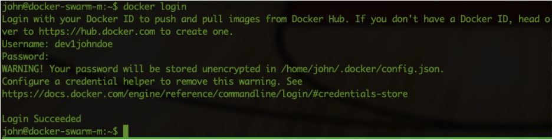

Ok, step one done.... Up to the next step.

Tagging images
..............

He runs **docker image ls** to see the images that are on his machine

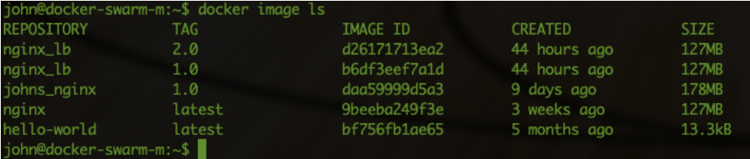

Ok so my images are still there. So they are tagged, but let’s tag the 2.0 version of the nginx_lb image to also being the latest version. John runs **docker image tag nginx_lb:2.0 nginx_lb:latest** to tag the image to the latest version (https://docs.docker.com/engine/reference/commandline/image_tag/). He then runs **docker image ls** to see the new tagging.

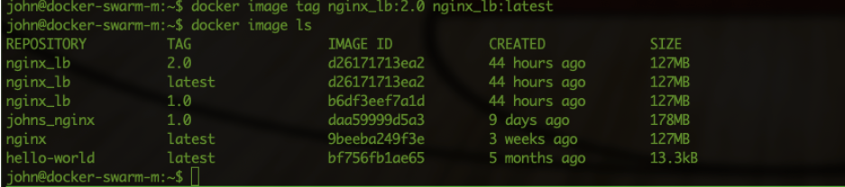

Ok tagging done, what’s next?

Pushing images to repo
......................

He reads that running the command **docker push <IMAGE NAME>:<TAG>** he is able to push images in his repo (https://docs.docker.com/engine/reference/commandline/push/). So he runs **docker push nginx_lb:latest**, but gets an error! Rereading the article he sees that he needs to have the image tagged with the repo in its tag. So he runs **docker tag nginx_lb:latest dev1johndoe/nginx_lb:latest** and reruns the **docker image ls** command to see the images. He then runs **docker push dev1johndoe/nginx_lb:latest** to have his image pushed onto the repo.

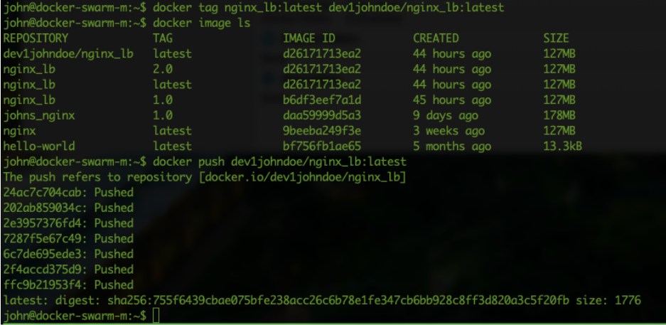

In the repo on hub.docker.com he also sees his image as a repo

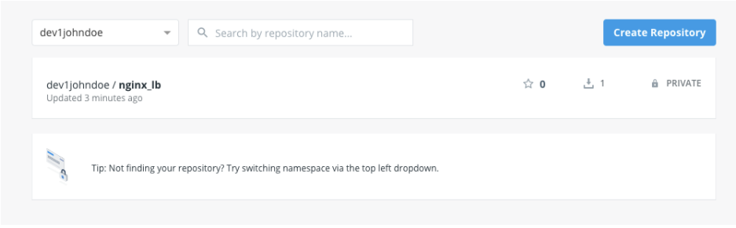

"Ok so the push did work. Can I now use it???". Let’s test...

John removes his image dev1johndoe/nginx_lb by using the command **docker image rm dev1johndoe/nginx_lb:latest** and runs **docker image ls **directly afterwards to check the image is gone.

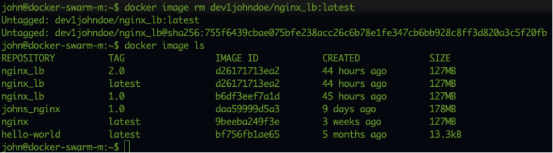

He then runs **docker run -d --rm --name nginx_lb -v /home/john/www/nginx:/etc/nginx/ -p 80:80 dev1johndoe/nginx_lb** to see if he can pull the image from his repo and if the container started by using **docker ps**.

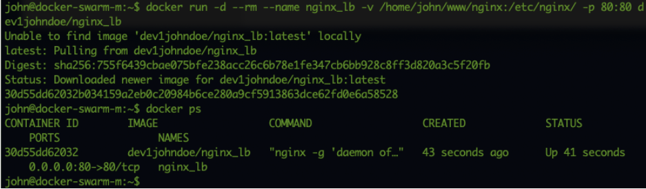

Ok so it was able to pull the new image AND the container is running... John checks the log using **docker exec nginx_lb tail -f /var/log/access_lb.log** and sees that the load balancer is using all the defined containers again.

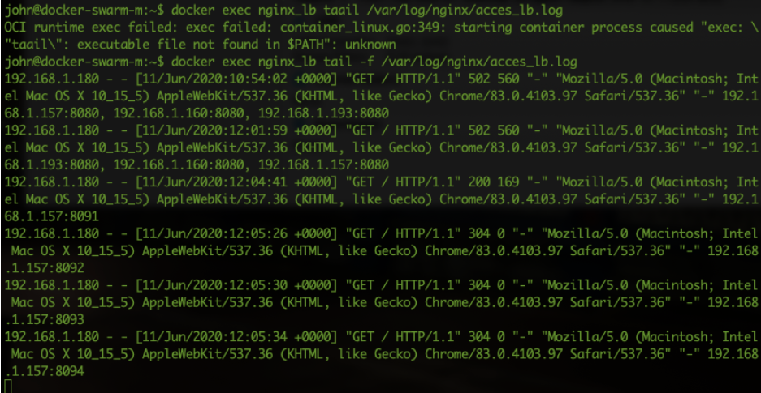

John decides to also push his nginx image to the repo... He tags the image with **docker tag johns_nginx:1.0 dev1johndoe/nginx:latest** and pushes the image using **docker push dev1johndoe/nginx:latest**

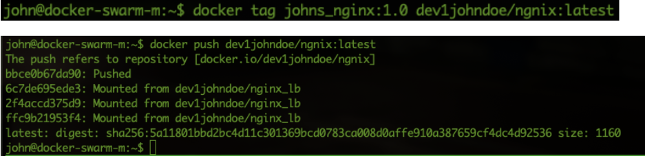

On his repo at hub.docker.com he sees two images that he just uploaded...

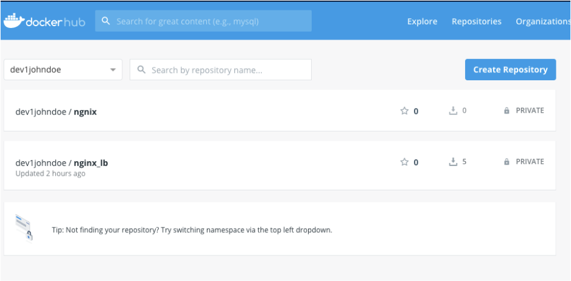

That gets step two of the organizations requirements (:ref:`requirements`) out of the way as well as the set sub golas for today... Now let’s see how I can make this a HA solution for the web servers and maybe even for the Load Balancer....

Creating a HA solution for Containers
.....................................

John is searching the internet and sees that there are two main players now for creating a clustered environment (orchestration) for his containers he just created. Docker Swarm and Kubernetes. One of the articles he found, https://phoenixnap.com/blog/kubernetes-vs-docker-swarm, gave to his opinion a very good comparison between the two solutions. Even though he tends to lean more towards kubernetes, one line is returning over and over again.. **Initial setup is simple on Docker Swarm and difficult on Kubernetes**. As John is a novice in the world of containers and orchestration in particular, he decides to put his money on Docker Swarm for this project. If all works, let’s see if we can transform this solution to a Kubernetes platform when the time is right. Docker Swarm can be built using any cloud solution, natively or not, so that takes care of the organization's requirement that we should be able to transport to the cloud.... So either solution, we’re covered...

Docker Swarm 
............

Before John starts all of this he’s cloning his Ubuntu Docker Virtual machine twice and renames all hosts using the **hostnamectl** command so that the names he sees in the prompt are easier to understand, and reboots them so they show the correct name.
He uses the following name convention:

#. 1st Ubuntu server -> Master -> swarm-docker-m at 192.168.1.157
#. 2nd Ubuntu server -> Worker 1 -> swarm-docker-w1 at 192.168.1.160
#. 3rd Ubuntu server -> Worker 2 -> swarm-docker-w2 at 192.168.1.193

He then opened three ssh sessions so he could run commands if needed (pro tip: use tmux https://linuxize.com/post/getting-started-with-tmux/ you need to get used to it, but it is quite handy.)

.. note::
	All further screenshots are from tmux screens

	.. figure:: images/12.png

He switches to his to be master node and runs **docker swarm init** and the command returns a command to have other nodes join the swarm master.

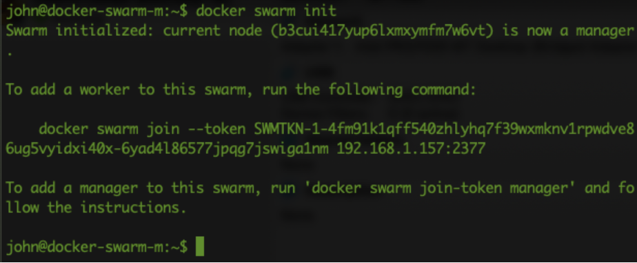

He then runs the shown command **docker swarm join --token SWMTKN-1-4gm91...** on the two other nodes. After he ran the commands he switched back to the master node and runs **docker node ls** to see if the swarm has 1 manager and 2 workers.

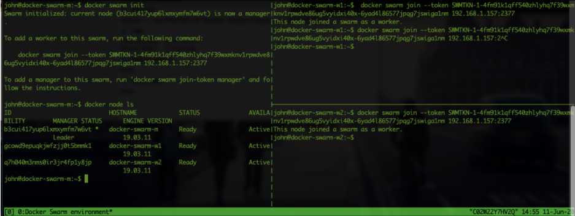

And he sees three nodes in the swarm. Ok so the swarm is running. Now we need to get the image from the repo, start the web servers and have them use the nfs location on the alpine_nfs server at 192.168.1.220.

Containers and Volumes in Docker Swarm
......................................

On the Alpine server he had to make a small change to the exports. He changed the exports to the following:

- **/www/nginx	192.168.1.0/24(rw,sync,no_subtree_check)**
- **/www 192.168.1.0/24(rw,sync,no_subtree_check)**

After the changes have been made, he runs **exportfs -a** so the nfs server exports the new exports. That way he would have more control on what gets mounted where. Even though the locations are somewhat alike, it would help he thinks. Let’s see... and try...

Going onto the internet to get some detailed information he read the following articles:

- https://blog.dahanne.net/2017/11/20/docker-swarm-and-nfs-volumes/#Mounting_a_NFS_share_to_a_Docker_service
- https://docs.microsoft.com/en-us/virtualization/community/team-blog/2017/20170419-use-nginx-to-load-balance-across-your-docker-swarm-cluster
- https://collabnix.com/docker-1-12-swarm-mode-persistent-storage-using-nfs/

He combined the information to his environment and runs the command **docker service create --mount 'type=volume,volume-opt=o=addr=192.168.1.220,volume-opt=device=:/www,volume-opt=type=nfs,source=nfs_nginx,target=/usr/share/nginx/html/,volume-nocopy=true' --replicas=3 --name swarm_nginx --publish mode=host,target=80,published=8080 dev1johndoe/nginx** on the master node of his Docker Swarm. 

He sees that two of the nodes have issues pulling the image and shows *errors: not found an image with the name dev1johndoe/nginx*. John looks again at the screen and sees that each node will download the image locally! He looks at the docker hub and finds that the image is in *Private* mode. He changes that to **Public (Settings->Make Public)** and the nodes are able to retrieve the image. After a few seconds he sees that the command shows **verify: Service converged**. 

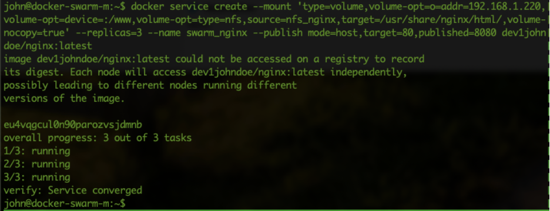

He checks the website using a browser and uses the IP addresses as the URLs and adds port 8080 to them. The websites are up and they are showing his original container pages. So we seem to have a NFS connection to the Alpine NFS server. Let’s change the index.html to see if we are correct in our assumption. John changes the index.html to show **Welcome to Johns Swarm environment**. He saves the file and retries the webservers on port 8080 to see if they show the correct information. He now uses a simple script, modified from the last one, to check the content. 

.. code-block:: bash

	for i in 157 160 193; do curl -i http://192.168.1.$i:8080;echo ; done.

He sees that all three sites reply with the expected information. 

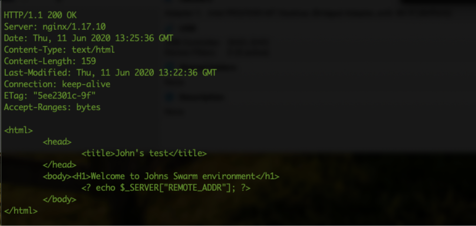

Ok, so the web servers are running, now let’s get the Load Balancer running on this swarm as well...

To be sure the system grabs the image from the repo he changes the image to dev1johndoe/nginx_lb and deletes the local one on his master using **docker image rm dev1johndoe/nhinx_lb**.

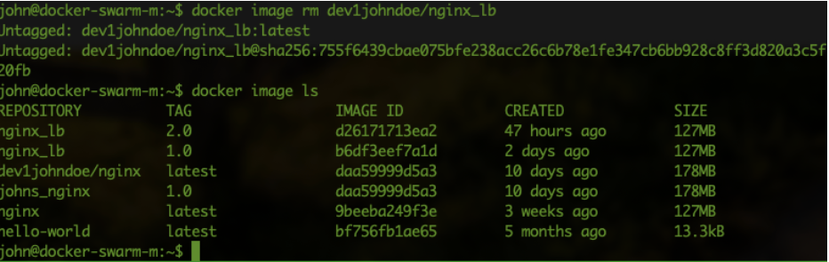

John checks quickly on hub.docker.com and sees that the image is also private and changes that to private. He is going to sort that out later on in the project.... Now let’s test if all works now. He uses the command line he used to start the web servers and makes the necessary changes so the load balancer can start. **docker service create --mount 'type=volume,volume-opt=o=addr=192.168.1.220,volume-opt=device=:/www/nginx,volume-opt=type=nfs,source=nfs_nginx_lb,target=/etc/nginx/,volume-nocopy=true' --replicas=1 --name swarm_nginx_lb --publish mode=host,target=80,published=80 dev1johndoe/nginx_lb** according to the output of the command, **verify: Service converged** the load balancer is running

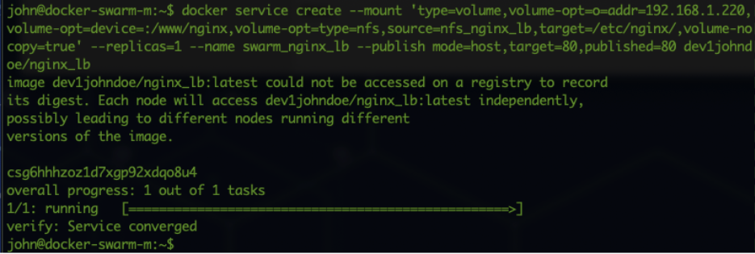

Ok let’s jump into the URL of the load balancer, the IP addresses of the master to see if the Load Balancer is running. He gets the information he was expecting. The browser is showing **Welcome to Johns Swarm environment**. So that seems to have worked!!! Great!!

Now to see the log file of the load balancer also shows that all the three nodes are being used for providing the data. John has found an article that describes an alike situation (https://stackoverflow.com/questions/39362363/execute-a-command-within-docker-swarm-service/48944377) and runs **docker exec -ti swarm_nginx_lb.1.$(docker service ps -f 'name=swarm_nginx_lb.1' swarm_nginx_lb -q --no-trunc | head -n1) tail -f /var/log/nginx/access_lb.log** and sees that the load balancer is balancing between web servers, but not those that he expected. The load balancer is still on the “old” config files and uses the containers that have the different ports... "Man. Forgot to stop those containers..". John stops the "old" containers and returns to the load balancer’s URL. Now he gets an error of **Bad Gateway**. Ok this is more like it.. Now John has to change the config of the load balancer to use the three nodes where the containers run in the Docker Swarm. 

Update the NGINX in the swarm on all nodes
..........................................

The content of the file www/nginx/conf.d/default.conf in his local mounted nfs from earlier (**sudo mount -t nfs 192.168.1.220:/www www**). The file after the change looks now like:

.. code-block:: bash

	upstream loadbalance {
	    least_conn;
	    server 192.168.1.157;
	    server 192.168.1.160;
	    server 192.168.1.193;
	}
	server {
	    access_log /var/log/nginx/access_lb.log main;
	    location / {
	        proxy_pass http://loadbalance;
	    }
	}

Now he can two things: 1) restart the swarm service, or 2) reload the nginx configuration. The first is the easiest, BUT he will have down time. So he tries to run the first solution. He again runs the command, but slightly changes the task the container needs to run: **docker exec -ti swarm_nginx_lb.1.$(docker service ps -f 'name=swarm_nginx_lb.1' swarm_nginx_lb -q --no-trunc | head -n1) nginx -s reload** (https://serverfault.com/questions/108261/how-to-make-a-modification-take-affect-without-restarting-nginx). He then reloads the URL of the load balancer and yes! The page is working again. The **docker exec -ti swarm_nginx_lb.1.$(docker service ps -f 'name=swarm_nginx_lb.1' swarm_nginx_lb -q --no-trunc | head -n1) tail -f /var/log/nginx/access_lb.log** command he used earlier is now showing the load balancer is balancing between the three defined IP addresses.

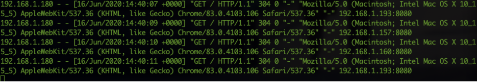

"You know what? I'm done for today. Let's see whayt we can do tomorrow..." John thinks. He closes his laptop and heads home...
