.. _day6:
.. title:: Introduction to Docker

.. note::
   Estimated amount of time: ``120 minutes``

Day 6 - Dockerfile and changing images with Docker Swarm
========================================================

John has Docker Swarm running on three ndoes and is heading fast through his ibjective he has been given by the organisation. For today John has set the following two goals:

#. How can I use a Dockerfile to crete my own image, more detailed?
#. Create a Alpine based image with NGINX and php?

John does some research on a small container and almost every time he sees that Alpine is being mentioned as a small O/S that is used in containers often. He decides to give it a go and has set two items he wants to solve:

1. Use a Dockerfile to create new image
2. Use Alpine with nginx and php in it.

.. note::
    All shown screenshots are examples. Your IP addresses will be different as shown in the screenshots throughout the workshop!

Creating a nginx image with php included
........................................
After having his test environment started and tested to see that the mater and the two workers are active using ``docker node ls`` on the master, John is going to use two articles that he found on the internet to have his Alpine NGINX and PHP image. The two sites are:

#. https://wiki.alpinelinux.org/wiki/Nginx_with_PHP
#. https://blog.ruanbekker.com/blog/2017/08/27/building-a-alpine-nginx-php-fpm-image-on-docker-for-php-applications/
   
John decides to follow the second link and see where it leads... 

He creates a new directory called *alpine_nginx* on his docker-swarm-vm /home/john and creates a Dockerfile from the examples in the article. The Dockerfile, John changed it a bit as not all is needed (like SMTP etc.), looks like this:

.. code-block:: bash

    FROM alpine

    RUN apk update \
        && apk add nginx \
        && adduser -D -u 1000 -g 'www' www \
        && mkdir /www \
        && chown -R www:www /var/lib/nginx \
        && chown -R www:www /www \
        && rm -rf /etc/nginx/nginx.conf

    ENV PHP_FPM_USER="www"
    ENV PHP_FPM_GROUP="www"
    ENV PHP_FPM_LISTEN_MODE="0660"
    ENV PHP_MEMORY_LIMIT="512M"
    ENV PHP_MAX_UPLOAD="50M"
    ENV PHP_MAX_FILE_UPLOAD="200"
    ENV PHP_MAX_POST="100M"
    ENV PHP_DISPLAY_ERRORS="On"
    ENV PHP_DISPLAY_STARTUP_ERRORS="On"
    ENV PHP_ERROR_REPORTING="E_COMPILE_ERROR\|E_RECOVERABLE_ERROR\|E_ERROR\|E_CORE_ERROR"
    ENV PHP_CGI_FIX_PATHINFO=0
    ENV TIMEZONE="Europe/Amsterdam"

    RUN apk add curl \
        tzdata \
        php5-fpm \
        php5-mcrypt \
        php5-soap \
        php5-openssl \
        php5-json \

    RUN sed -i "s|;listen.owner\s*=\s*nobody|listen.owner = ${PHP_FPM_USER}|g" /etc/php5/php-fpm.conf \
        && sed -i "s|;listen.group\s*=\s*nobody|listen.group = ${PHP_FPM_GROUP}|g" /etc/php5/php-fpm.conf \
        && sed -i "s|;listen.mode\s*=\s*0660|listen.mode = ${PHP_FPM_LISTEN_MODE}|g" /etc/php5/php-fpm.conf \
        && sed -i "s|user\s*=\s*nobody|user = ${PHP_FPM_USER}|g" /etc/php5/php-fpm.conf \
        && sed -i "s|group\s*=\s*nobody|group = ${PHP_FPM_GROUP}|g" /etc/php5/php-fpm.conf \
        && sed -i "s|;log_level\s*=\s*notice|log_level = notice|g" /etc/php5/php-fpm.conf \
        && sed -i 's/include\ \=\ \/etc\/php5\/fpm.d\/\*.conf/\;include\ \=\ \/etc\/php5\/fpm.d\/\*.conf/g' /etc/php5/php-fpm.conf

    RUN sed -i "s|display_errors\s*=\s*Off|display_errors = ${PHP_DISPLAY_ERRORS}|i" /etc/php5/php.ini \
        && sed -i "s|display_startup_errors\s*=\s*Off|display_startup_errors = ${PHP_DISPLAY_STARTUP_ERRORS}|i" /etc/php5/php.ini \
        && sed -i "s|error_reporting\s*=\s*E_ALL & ~E_DEPRECATED & ~E_STRICT|error_reporting = ${PHP_ERROR_REPORTING}|i" /etc/php5/php.ini \
        && sed -i "s|;*memory_limit =.*|memory_limit = ${PHP_MEMORY_LIMIT}|i" /etc/php5/php.ini \
        && sed -i "s|;*upload_max_filesize =.*|upload_max_filesize = ${PHP_MAX_UPLOAD}|i" /etc/php5/php.ini \
        && sed -i "s|;*max_file_uploads =.*|max_file_uploads = ${PHP_MAX_FILE_UPLOAD}|i" /etc/php5/php.ini \
        && sed -i "s|;*post_max_size =.*|post_max_size = ${PHP_MAX_POST}|i" /etc/php5/php.ini \
        && sed -i "s|;*cgi.fix_pathinfo=.*|cgi.fix_pathinfo= ${PHP_CGI_FIX_PATHINFO}|i" /etc/php5/php.ini
        
    RUN rm -rf /etc/localtime \
        && ln -s /usr/share/zoneinfo/${TIMEZONE} /etc/localtime \
        && echo "${TIMEZONE}" > /etc/timezone \
        && sed -i "s|;*date.timezone =.*|date.timezone = ${TIMEZONE}|i" /etc/php5/php.ini \ 
        
    COPY alpine_nginx.conf /etc/nginx/nginx.conf
    COPY start_nginx.sh /start_nginx.sh
    COPY start_php-fpm5.sh /start_php-fpm5.sh
    COPY wrapper.sh /wrapper.sh

    RUN chmod +x /start_nginx.sh /start_php-fpm5.sh /wrapper.sh

    CMD ["/wrapper.sh"]

He also created the other files that were mentioned in the articles. The total Directory looks like this:

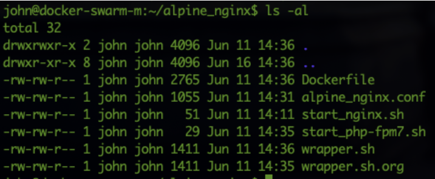

After he has all the needed data, he starts the build using docker build and also adds tags so he can upload the images into his repository he created earlier this week. The command he uses is ``docker build -t dev1johndoe/alpine_nginx_php:1.0 -t dev1johndoe/alpine_nginx_php:latest .`` During the build process he sees an issue. Php-fpm5 is a package that is not existing for the Alpine 3.11 (the version that is being used). He changes all the ``references from php5 to php7`` in the Dockerfile.

He then rebuilds the image using the same tags. The build has been successfully completed. After the build, John is eager to test his new image out. 

Test the new image Alpine nginx/php
...................................

John runs the ``docker run -it --name anp --rm dev1johndoe/alpine_nginx_php:latest`` command and sees that it instantly crashes. The system cannot find the php-fpm7 it seems. “Hmmm how can I test?? I need a process that is running constantly otherwise the container will stop and not have anything I can attach to...”. John changes the wrapper.sh, as that is the file that is being called by the start of the cluster, as that is showing ``CMD [“/wrapper.sh”]``. He changes it to ``CMD ["/bin/sh"]`` and saves the file. He then rebuilds the image and starts the container again using ``docker run -it --name anp --rm dev1johndoe/alpine_nginx_php:latest``. 

After the start he gets a command prompt and runs ``find /* -name php-fpm7`` to search for the location of the php-fpm7 binary. He sees that the location is *not the same as the start_php-fpm7.sh script*. He changes the script to reflect the correct location and reruns the build command and also *reverts back to the original wrapper.sh* script and changes the files and references to php5 in the files. He changes the following files:

#. Dockerfile
#. start_php-fpm5.php and renamed to start_php-fpm7.php
#. wrapper.sh

Download the files here:

- Dockerfile :download:`Dockerfile`
- wrapper.sh :download:`wrapper.sh`
- start_nginx.sh :download:`start_nginx.sh`
- start_php-fpm7.sh :download:`start_php-fpm7.sh`
- alpine_nginx.conf :download:`alpine_nginx.conf`
  
He saves the file and runs the ``docker run`` command again. Now he sees that the logs are showing that php-fpm7 and nginx are starting and are ok.

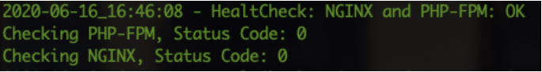

He cancelled his session using ``<CTRL>+C`` and dropped back to his machines prompt. Also the container has been removed automatically as he expected as he used the *--rm* parameter in the ``docker run`` command. Ok now let’s see if everything works. 

In his */home/john/www* directory on the swarm-docker-master he creates a file called *index.php* and the content of the file is:

.. code-block:: php

    <?PHP
    function getUserIP()
    {
                $client  = @$_SERVER['HTTP_CLIENT_IP'];
                    $forward = @$_SERVER['HTTP_X_FORWARDED_FOR'];
                    $remote  = $_SERVER['REMOTE_ADDR'];
                       if(filter_var($client, FILTER_VALIDATE_IP))
                                    {
                                                    $ip = $client;
                                                        }
                            elseif(filter_var($forward, FILTER_VALIDATE_IP))
                                        {
                                                        $ip = $forward;
                                                            }
                            else
                                        {
                                                        $ip = $remote;
                                                            }
                        return $ip;
    }

    $user_ip = getUserIP();
    ?>
    <HTML>
    <body>
    <H1> Welcome to John's NGINX and PHP webserver running on Alpine</H1>
    You have reached us!!! You IP address is:<?PHP
    echo $user_ip; // Output IP address [Ex: 177.87.193.134]
    ?>
    <h4> if you don't see the IP address, you have used the wrong port</h4>
    </body>
    </html>

He saves the file and starts a container with the image. Now as he needs to get the data external from the container he is using the *-v* parameter. He remembers seeing that the configuration of the nginx.conf has a different location than the default location for the HTML files. /www seems to be the root of the nginx server. The docker command he uses is:
``docker run -d --name anp --rm -v /home/john/www/:/www -p 81:80 dev1johndoe/alpine_nginx_php:latest`` . He also changes the port to 81 as port 80 has been taken by the load balancer. He hits the Enter Key and the command is returning a UUID for the container.

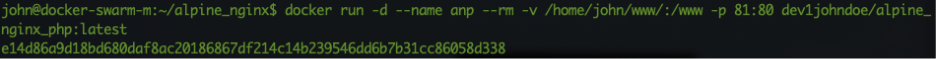

He opens the browser and types \http://192.168.1.157:81/index.php (the IP address of his swarm-docker-master node) and sees that the php engine is working!!!

If he forgets the index.php in the URL, nginx will automatically show the normal page that also the three nodes are showing. Reason is that in the nginx.conf file, index.html is defined before the index.php. John follows these steps to make sure that index.php is opened BEFORE index.html:

1. stop the docker container using ``docker stop anp``
2. changes the order in his alpine_nginx.conf file

   .. figure:: images/5.png

3. rebuild the image using ``docker build -t dev1johndoe/alpine_nginx_php:1.0 -t dev1johndoe/alpine_nginx_php:latest .``
4. redeploy a container using the new image using ``docker run -d --name anp --rm -v /home/john/www/:/www -p 81:80 dev1johndoe/alpine_nginx_php:latest``

So he made it through all the steps and opens the browser. Yes that is what he was looking for:

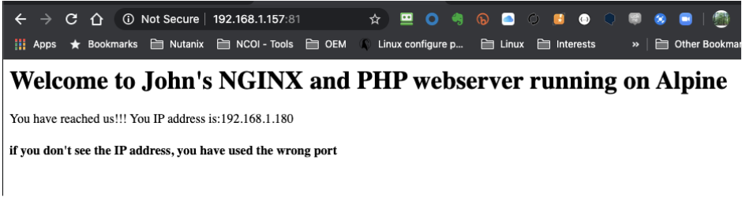

So no extra info, just the root of the URL and the page turns up great. Simple, but it works....

Push the new nginx image
........................

Now that John has the new image and it is working he pushes the image to his docker hub so it can be used in the future. One reason he needs to push this to the repository is because the next step is to get the container started with the new image in the docker swarm he has running.

John uses the command ``docker login`` to get his session connected into the docker hub repo.
As John already has logged in before, the command uses the store credentials

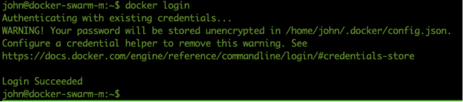

By using the command ``docker push dev1johndoe/alpine_nginx_php:latest`` (name of the image) the image is pushed onto his repo...

.. figure:: images/8.png

On the webpage of hub.docker.com, John changes his Repo from Private to Public so that the Docker swarm nodes can pull the images.

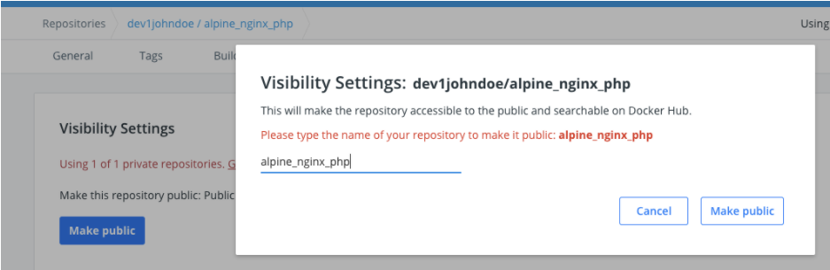

So that is done and ready. The image can be accessed by the swarm nodes... Let’s try to get them up and running in the Docker Swarm

Run the new image as a service in Docker Swarm
..............................................

John checks on the swarm-docker-m VM, to see that all his nodes are up and running via the command docker node ls and sees they are Ready and Active...

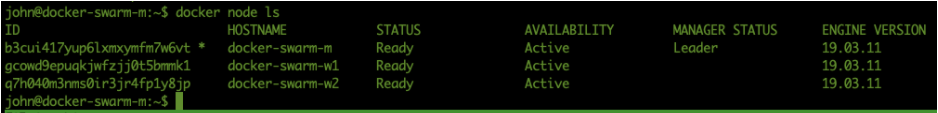

John canes the common, he used earlier, to start the three containers as a service using the new image. ``docker service create --mount 'type=volume,volume-opt=o=addr=192.168.1.220,volume-opt=device=:/www,volume-opt=type=nfs,source=nfs_nginx,target=/www,volume-nocopy=true' --replicas=3 --name swarm_nginx_php --publish mode=host,target=80,published=8081 dev1johndoe/alpine_nginx_php``. The new containers must listen on another port as the port 8080 is already in use by the other containers.

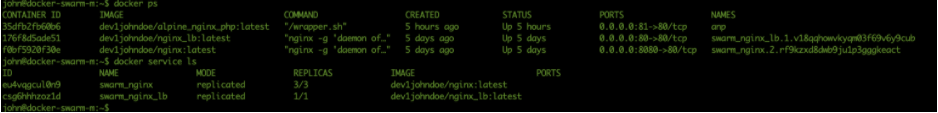

He runs the command and sees the message ``verify: Service converged``. The service is running on the nodes...

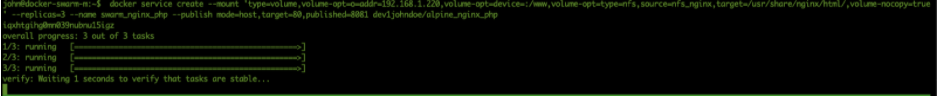

Let’s check; John runs ``docker ps`` and sees that on his master the container is running and listening on port 8081.

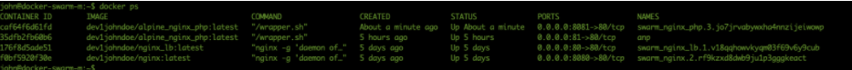

Checking the browser on the URL of his master John sees:

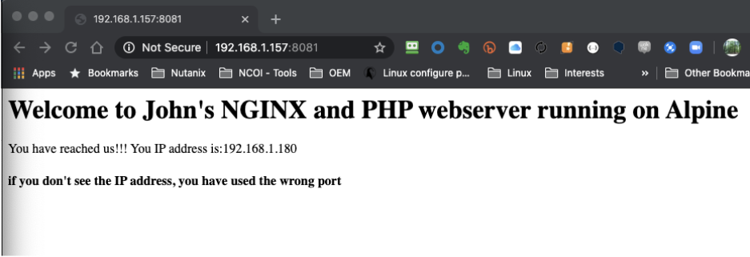

So the Docker Swarm seems to have the containers running. Let’s check using ``docker service ps swarm_nginx_php``

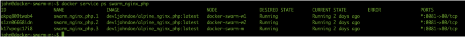

All the nodes in the Docker Swarm are running the container and listen on port 8081. A quick check using the browser and changing from one to the other IP address is showing the correct page.

Change the load balancer to use the new containers
..................................................

Now that the Docker Swarm is running the containers on port 8081, and all three are active, the configuration of the load balancer needs to reflect these new containers. John changes the configuration file of nginx and his mounted NFS server (``/home/john/www/nginx/conf.d/default.conf``) to use the new containers and corresponding ports. The content of the file now is showing:

.. code-block:: bash

    upstream loadbalance {
        least_conn;
        server 192.168.1.157:8081;
        server 192.168.1.160:8081;
        server 192.168.1.193:8081;
    }
    server {
        access_log /var/log/nginx/acces_lb.log main;
        location / {
            proxy_pass http://loadbalance;
        }
    }

He reloads the configuration file of the load balancer by rerunning the same command he used earlier ``docker exec -ti swarm_nginx_lb.1.$(docker service ps -f 'name=swarm_nginx_lb.1' swarm_nginx_lb -q --no-trunc | head -n1) nginx -s reload``. 

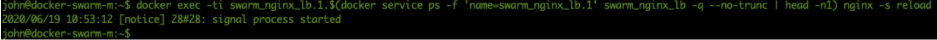

He then runs ``docker exec -ti swarm_nginx_lb.1.$(docker service ps -f 'name=swarm_nginx_lb.1' swarm_nginx_lb -q --no-trunc | head -n1) tail -f /var/log/nginx/access_lb.log`` to see if the load balance is using the new configuration.

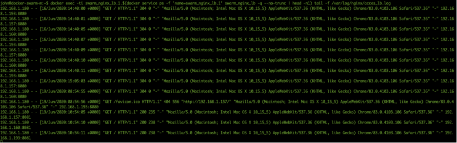

Yes it is using the three IP addresses, Also the website is showing the new content with the PHP information in it...

“Hmmm this way I can develop AND have production ready and no interruption on the change!!! That is not even a requirement, so that would be a big benefit for the organisation...!!!”.

Adding a master node in the swarm
.................................

Now that John has ticked most of his to be solved :ref:`requirements`, except the CI/CD task, he now focuses on the HA requirement. He has solved the workloads, but what about the Swarm itself? How can I add nodes and masters and test them? Well let’s first see how to add nodes and masters. I only have one master. What happens if that one dies???”

After a quick Google search he found this article that describes how to add a Master to the Swarm https://docs.docker.com/engine/swarm/join-nodes/. He also reads that the swarm needs to have an odd number of managers so there is a quorum running (https://docs.docker.com/engine/swarm/admin_guide/). So he runs the following steps:

#. Create two new Ubuntu servers
#. Install nfs client
#. Install Docker on the new servers
#. Add the nodes to the swarm as a master using the command described in the article

John runs the command he found from the article, ``docker swarm join-token manager`` to get the command that needs to be run on the other masters.

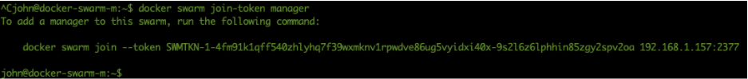

John runs the command on two new swarm masters and sees that the new machines have been added to the swarm.

The command ``docker node ls`` as shows that the node is added as a master and that it is reachable.

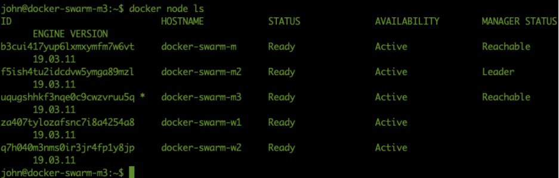

John reads that the ``docker node ls`` command can not be run on a node. As he wants to test whatever is possible to make sure what he reads is right he runs that command ``docker node ls``, on one of the nodes and gets the error message as described in what he read...

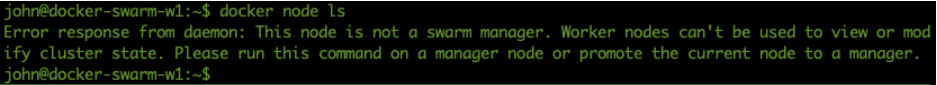

So he runs the command on the second master and gets the reply he saw from the first master node in the swarm.

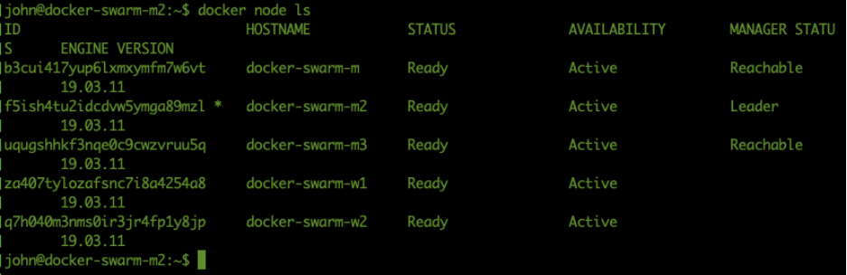

So now all should be ok to run some failure tests...

Test failure of master and node
...............................

John has set the following tests to be run and documented:

#. Fail a master
#. Fail two masters
#. Fail a worker node
#. Fail two worker nodes

Test 1 - Fail one master
^^^^^^^^^^^^^^^^^^^^^^^^
John is using the first master to see what happens to the web server if one master dies. He stops the docker services on the machine using the command ``service docker stop``. As the command can only be run as root, he needs to provide his password to make the command work.

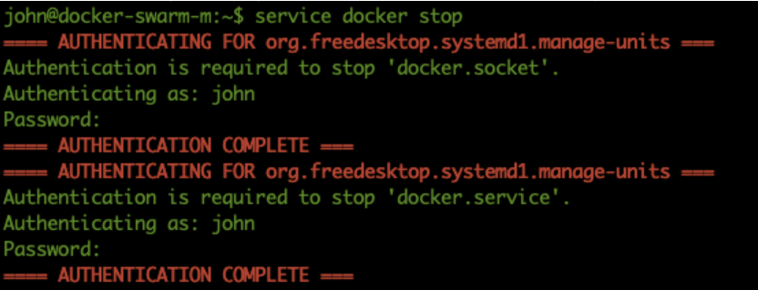

John then runs the command ``docker ps`` and gets the error message is the docker daemon running?

Running the command ``docker service ps swarm_nginx_lb``, John sees that the service has been pushed onto another server. In this case also a master.

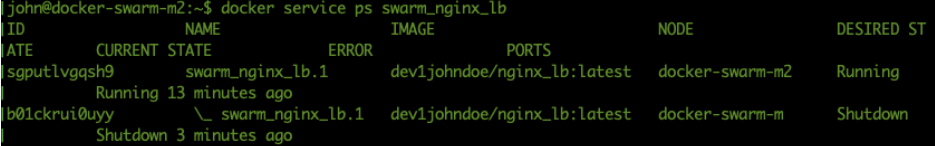

Test 2 - Fail two masters
^^^^^^^^^^^^^^^^^^^^^^^^^

John leaves the master down and shuts down the second master M2 by stopping the docker services.
On the remaining node of the Docker Swarm he runs ``watch docker node ls`` and gets an error: 

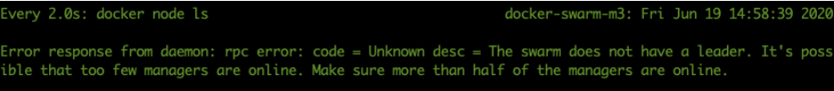

.. note::
    The process ``watch docker node ls`` is kept running on the master from Test 2

Ok so more than half of the masters must be running! Aha good to know!

He start the second master again to bring the cluster back into the production environment. As soon as the master is back up the command on the remaining node is returning information.

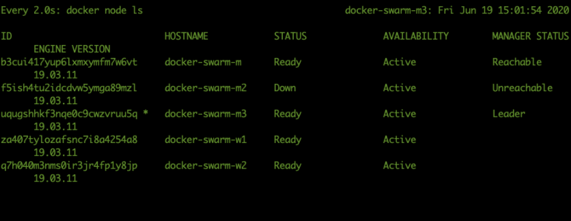

After having all the masters back online he sees that in the watch command all nodes are ready and the Manager Status is Leader or Reachable for all the managers nodes.

.. figure:: images/28.png

Test 3 - Stop a worker node
^^^^^^^^^^^^^^^^^^^^^^^^^^^

John is repeating the test with one of the worker nodes he has to see the outcome. He *stops the docker service* on the first node ``swarm-docker-w1`` and looks to see what happens. As soon as he stopped the services in his watch docker service he saw that the service has been restarted on another node... The process on swarm-docker-w1 has been shutdown and restarted on docker-swarm-m3

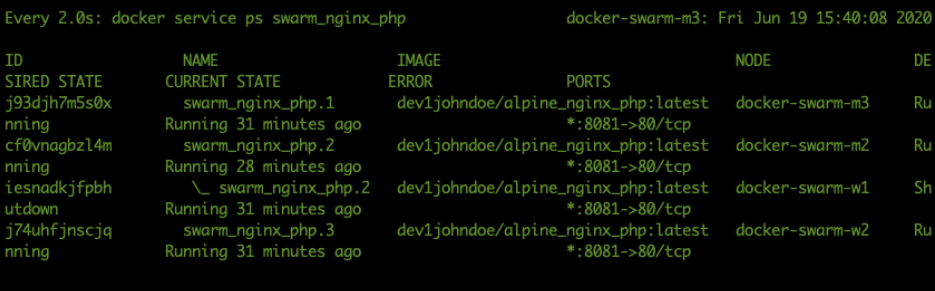

Test 4 - Stop two workers
^^^^^^^^^^^^^^^^^^^^^^^^^

John reruns the ``service docker stop`` command on the second worker and sees again that the service is started on another node.

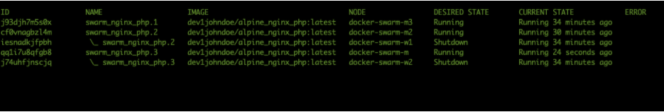

Tests Conclusion
^^^^^^^^^^^^^^^^

John is starting all nodes in the Swarm again. He concluded the following:

#. Multiple masters CAN be down, just as long as the majority of the masters in the Docker Swarm are active. Below that the Swarm becomes “useless”.
#. Multiple Workers CAN be down. As long as there are enough remaining nodes, including master, are available to run the replicas of the containers. If not, one or more replicas will not be able to start. This due to ports being occupied by other containers.
#. When the load balancer is running on the node that has been shutdown, the service gets transported, but the IP address also changes for the load balancer. That might be a big issue.... This has to be solved using DNS and some round robin method.. Ok we can fix that outside of this project.
