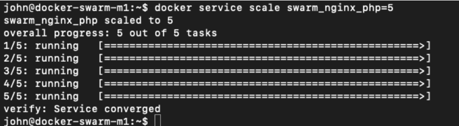
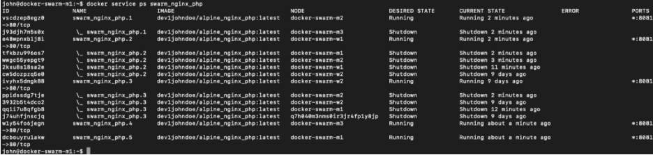
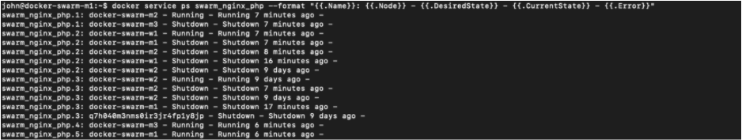
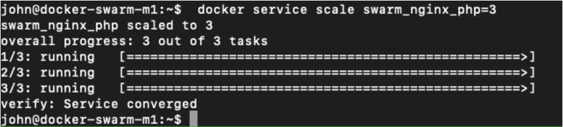
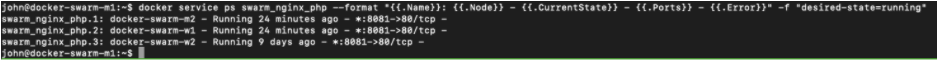
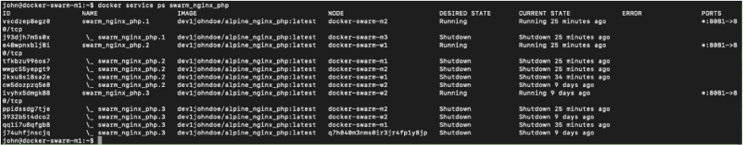
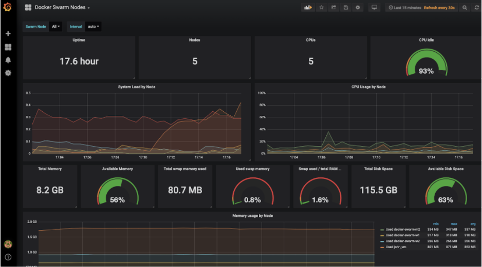
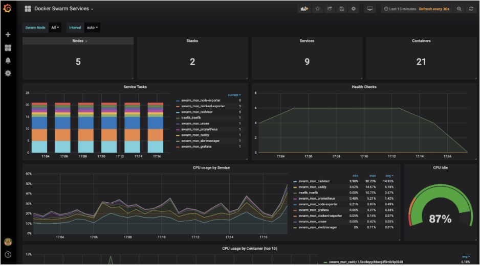

.. _day7:
.. title:: Introduction to Docker

.. note::
   Estimated amount of time: ``60 minutes``

Day 7 - Scaling and monitoring
==============================

John has gotten to his final day of the project. Over the last week he has learnt a lot with respect to Docker and containers in general. From no idea what a container is to creating them and deploying them on a Docker Cluster/Swarm.

These last few days made him eager to see what else would be easy and handy to understand. The following items John put on his last list of things he need to figure out:

1. Scaling and rebalance Applications
2. Monitoring containers

.. note::
    All shown screenshots are examples. Your IP addresses will be different as shown in the screenshots throughout the workshop!

Scaling
.......

One of the items that is very important in the whole project is to have the ability to scale out or scale in when needed. John has been doing some research and saw that during the holiday sessions, the amount of requests to the app have doubled and that brought a massive load on their infrastructure. Now using this app in a container based form, what about scaling? What is needed to scale out and scale in?
John uses Google and sees an article that literally describes this phenomenon. It seems that it can be easily done by running a command ``docker service scale <SERVICE_NAME>=X`` where *X is the number of replicas* you want to have in your swarm (https://docs.docker.com/engine/swarm/swarm-tutorial/scale-service/). John understands that making changes to the amount of replicas, the load balancer needs to be changed accordingly. That can be solved by other solutions, like a script...

Scale out
^^^^^^^^^

John had deployed 3 alpine php servers and now wants to update the replicas to number 5.
He runs the command ``docker service scale swarm_nginx_php=5`` and waits for the reply of the command. He gets five lines that fill up and they and with ``verify: Service Converged``.

The command ``docker service pd swarm_nginx_php`` is showing that there are five replicas running in the swarm.

The information returned is not easily to be read, so John searches if there is a way to format and filter the data/fields shown and finds that these can be added to the command he used earlier (https://docs.docker.com/engine/reference/commandline/service_ps/). He changes the command he used earlier to ``docker service ps swarm_nginx_php --format "{{.Name}}: {{.Node}} - {{.DesiredState}} - {{.CurrentState}} - {{.Error}}"`` and gets an output that shows a lot info on some nodes... but it is easier to be read...

 Now let’s see if we can filter on this to only show the running state...
John changes the command to ``docker service ps swarm_nginx_php --format "{{.Name}}: {{.Node}} - {{.CurrentState}} - {{.Ports}} - {{.Error}}" -f "desired-state=running"`` and now he gets a easy clean view on the service swarm_nginx_php, the nodes, the status and the ports on which the service replicas are listening. 

Scale in
^^^^^^^^

John ran the command ``docker service scale swarm_nginx_php=5`` and got in total 5 replicas running in his swarm. Now what would happen if we lower that number to ``3`` so we are back at the starting point. So he runs that command...

He sees that the command now has only 3 Progress lines... He runs that long command with the formatting to see where the containers life (``docker service ps swarm_nginx_php --format "{{.Name}}: {{.Node}} - {{.CurrentState}} - {{.Ports}} - {{.Error}}" -f "desired-state=running"``)...

Ok, now running on three nodes, but what does ``docker service ps swarm_nginx_php`` tell me?

Hmm ok, so still the same kind of data, but also the other statuses are shown of the other nodes with respect to the service. 

Monitoring
^^^^^^^^^^

The last part of the project is to see how the swarm can be monitored. John searches the internet and sees that there are many possibilities out there. From Open Source to paid solutions. He starts by using a free version, based on Open Source. His idea is that if the Open Source is able to monitor, a paid version will be more comprehensive. He uses the article from https://medium.com/@tiangolo/docker-swarm-with-swarmprom-for-real-time-monitoring-and-alerts-282da7890698 to build his monitoring platform.

John stops his environment via the command ``docker service rm swarm_nginx_lb`` and ``docker service rm swamr_nginx_php`` to free up resources before he starts to follow the article. 

After having the article followed he opens the webpage and finds that the system is pushing information. One thing he changed from the article as the DNS records. *He changed the hosts file (/etc/hosts) to reflect the IP addresses of his environment as the DNS is centrally managed and can not be easily changed*. This way his testing machine can run and show the pages needed.

Putting knowledge to work at home...
^^^^^^^^^^^^^^^^^^^^^^^^^^^^^^^^^^^^
“Hahahaha, this is quite easy to set up and I get some information. This is great! It also ticks the last item in my project; monitoring....Now as this has been for my organisation, what else can I do with containers..... I wonder...”, John thinks. He goes on the internet and finds a nice article.. “Now that is something I wanna build at home......” https://bit.ly/2VvNgVp
